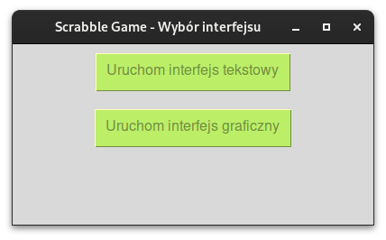
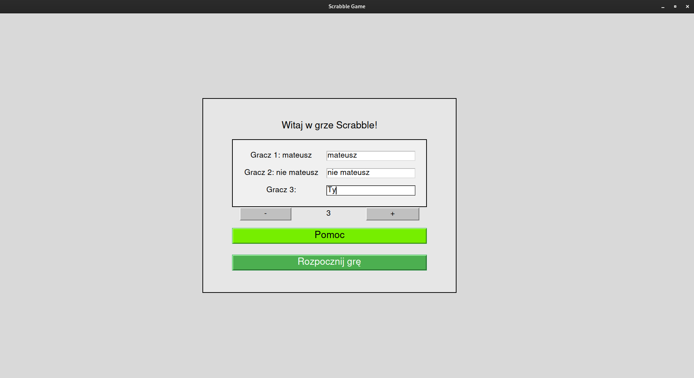
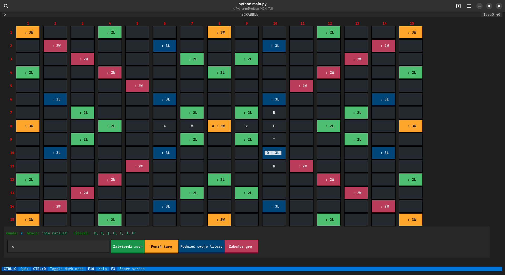
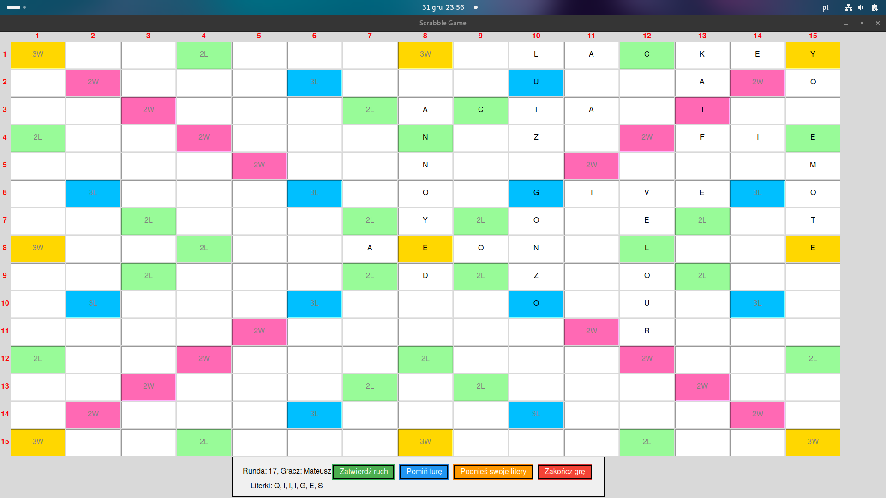
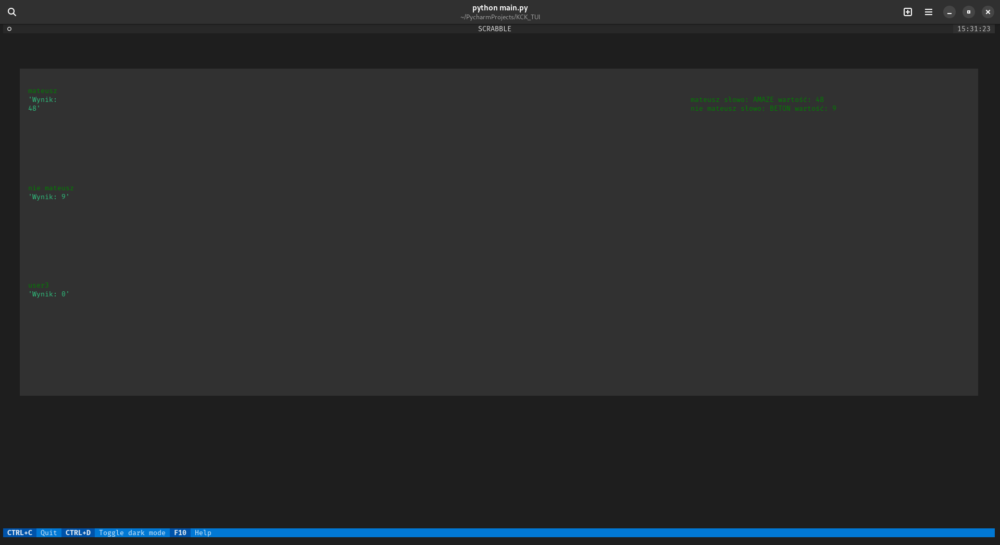

# Scrabble Game Repository

Welcome to the Scrabble Game repository! This project is an implementation of the classic Scrabble game in Python. Below, you'll find instructions on how to run the game along with some visual insights from the gameplay.

## About

This repository contains the source code for a Scrabble game implemented in Python. The game provides both a Text-based User Interface (TUI) and a Graphical User Interface (GUI) for a versatile gaming experience.

# How to run?
1. Clone repo
`git clone git@github.com:mateuszhorczak/KCK_Scrabble.git`
2. switch to venv
`source venv/bin/activate`
3. Install required packages
`pip install -r requirements.txt`
4. run
`python main.py`
5. if you want run in dev mode, you can do it with
`textual run --dev main.py`

## Gameplay Preview

Here are some glimpses of the Scrabble game:

1. 

   *Select user interface.*

2. 
   *Starting the game on the gui.*

3. 
   *Game board on the TUI.*

4. 
   *Game board on the GUI*

5. 
   *End game on the TUI.*

Feel free to explore the game and enjoy playing Scrabble!

## Authors

This app was created by [Mateusz Horczak](https://github.com/mateuszhorczak) as a academic project

## License

This app is licensed under the MIT License. See LICENSE.txt for more details.
